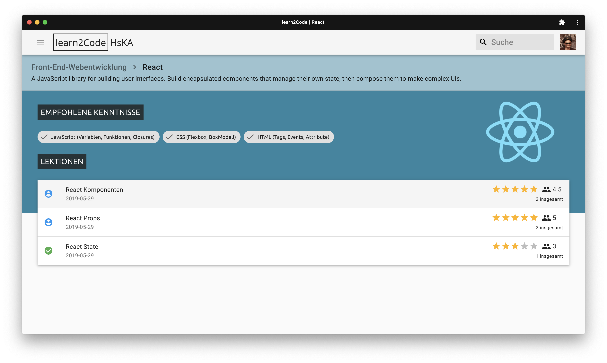

# learnToCode (<i>in development</i>)

## about this project

A learning platform for students - by students. Build with [Gatsby](https://www.gatsbyjs.org/), automated via [GitHub Actions](https://github.com/features/actions) and powered by [StackBlitz](https://stackblitz.com/). Firebase Functions, Auth and Firestore to handle backend stuff :rocket:

